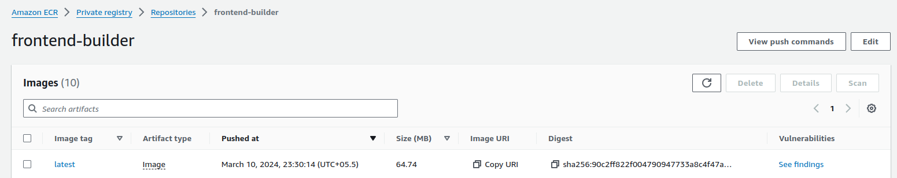

# Frontend Deployment Platform

> 🚧 **work in progress** 🚧

A vercel clone. Deploy SPAs directly from a git repository.

## Setup


> ### DISCLAIMER
> I am not an AWS expert, any vulnerability and cost that comes with the below setup is not within my responsibility.
> 
> ECS Fargate is not under AWS free tier. Consider using EC2 instead.

**Note**: Select your desired region in the AWS console before proceeding with any of these.

## Setting up IAM Role

1. Go to [IAM](console.aws.amazon.com/iam/home) > [Roles](console.aws.amazon.com/iam/home#/roles) in your [AWS console](console.aws.amazon.com)
2. Create a new role with the following settings

> **Trusted Entity Type**: AWS Service
>
> **Use Case**: Elastic Container service > Elastic Container Service Task
>
> **Permission Policies**: _AmazonECS_FullAccess_, _AmazonS3FullAccess_, _AWSAppRunnerServicePolicyForECRAccess_, _CloudWatchLogsFullAccess_
>
> **Role Name**: \<your choice\>

### Setting up S3

1. Go to Console > [S3](s3.console.aws.amazon.com/s3/home)
2. Create a new bucket
> **Bucket name**: \<your choice\>
>
> Uncheck "**Block all public access**" and check "**I acknowledge that the current settings might result in this bucket and the objects within becoming public.**"

3. Go to `Permissions` tab and click on the `Edit` button under the `Bucket Policy` section.

4. Add the following policy

```json
{
    "Version": "2012-10-17",
    "Statement": [
        {
            "Sid": "AllowWebAccess",
            "Effect": "Allow",
            "Principal": "*",
            "Action": "s3:GetObject",
            "Resource": "arn:aws:s3:::<bucket name>/deployments/*"
        }
    ]
}
```

Change `<bucket name>` with your bucket name.

5. Click on `Save Changes`


### Setting up ECR

This is where we will upload our build docker images.

1. Go to Console > [Elastic Container Registry](console.aws.amazon.com/ecr)
2. Create a new repository
> **Visiblity Settings**: Private
>
> **Repository Name**: \<your choice\>

3. Open `builder/deploy-docker.sh` and configure your registry url and the repository name (see the configuration section for more details)

Example:

```sh
REGISTRY=xxxxxxxx.xxx.xxx.ap-south-1.amazonaws.com
REPOSITORY_NAME=frontend-builder
```

4. cd into `builder/` and run the `deploy-docker.sh` script.

This will push the builder image into the ECR you just created.

**Note:** It may take some time for the first run. Subsequent runs will be faster.

### Setting up ECS

1. Go to Console > Elastic Container Service > [Task Definition](console.aws.amazon.com/ecs/v2/task-definitions)
2. Create a new task definition

> **Task definition family**: \<your choice\>
>
> **Launch Type**: AWS Fargate (not free under free tier)
>
> **Task role**: _select the IAM role you created_
>
> **Task execution role**: _select the IAM role you create_
>
> **Container - 1 > Name**: \<your choice\>
>
> **Container - 1 > Image URI**: _copy the image uri from elastic container registry you just created_



click on `Copy URI` to copy your image uri

> **Container - 1 > Environment variables**:

```sh
S3_BUCKET="srijan-frontend-deployments"

# Path path inside your s3 bucket where deployments will be uploaded
S3_DEPLOYMENT_DIRECTORY="deployments"

AWS_REGION="ap-south-1"
```

3. Click on `Create`

4. Go to Console > Elastic Container Service > [Clusters](console.aws.amazon.com/ecs/v2/clusters)

5. Create new cluster

> **Cluster name**: \<your choice\>
>
> **[WARNING]** AWS Fargate is not free under AWS Free Tier \
> **Infrastructure**: AWS Fargate (serverless) 

### Setting up Redis

Any online service will do. I used [aiven.io](https://aiven.io/) to spin up a free redis service.

**Note:** The redis needs to be online, since the builder containers push logs to it. You may even use ngrok to expose your local redis server online (I have not tested this).

## Configurations

Environment variable options. Also refer to `.env.example` file for a particular module.

### api

```sh
# api details (required)
AWS_ACCESS_KEY_ID
AWS_SECRET_ACCESS_KEY
AWS_DEFAULT_REGION

# ARN of the ECS cluster (required)
AWS_DEPLOYMENT_CLUSTER_ARN

# ARN of the task definition (required)
AWS_DEPLOYMENT_TASK_DEFINITION_ARN

# task launch type (required)
AWS_DEPLOYMENT_LAUNCH_TYPE=FARGATE

# name of the builder docker image (required)
AWS_DEPLOYMENT_TASK_DEFINITION_IMAGE_NAME

# comma separated list of subnets (required)
AWS_DEPLOYMENT_VPC_CONFIGURATION_SUBNETS

# comma separated list of security groups (Required)
AWS_DEPLOYMENT_VPC_CONFIGURATION_SECURITY_GROUPS=

# Redis uri (used for logs) (required)
REDIS_URI=

# Server port (optional) 
PORT=8000
```

### builder

In deploy-docker.sh, set your [ECR](https://docs.aws.amazon.com/AmazonECR/latest/userguide/what-is-ecr.html) docker registry url in the `REGISTRY` variable.

Set your repository name in the `REPOSITORY_NAME` variable

### reverse-proxy

```sh
# path to the s3 deployment folder
BASE_PATH=
```

